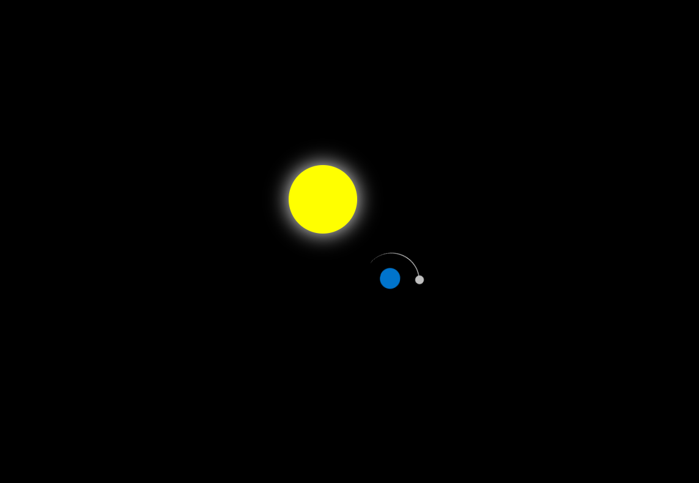

# 🌍 Earth-Orbit

A simple HTML/CSS animation simulating the Earth and Moon orbiting the Sun. Built using only one HTML file with internal CSS.

---

## 📁 Project Structure
```
Earth-Orbit/
│
├── index.html
├── README.md
│
├── screenshots/
│   └── orbit-preview.png
│
├── recordings/
    └── orbit-demo.mp4
```

---

## ⚙️ How to Run

Just open `index.html` in your browser:

```bash
# In your terminal or file explorer
double-click index.html
```

---

## 🖼️ Preview

**Screenshot**  


---

## 📹 Screen Recording

[🎥 Watch Demo](./recordings/orbit-preview.mp4)

---

## 🧠 Description

- The **Sun** is centered and glowing  
- The **Earth** orbits around the Sun  
- The **Moon** orbits around the Earth  
- All motion is handled by pure CSS animations (`@keyframes` + `transform: rotate`)

---

## 🛠️ Tech Used

- HTML
- CSS (no JavaScript!)
- VS Code

---

## 🤝 Credits

Built with 💙 by [Harris1250](https://github.com/Harris1250)  
_"Even in code, the Earth moves in circles."_
